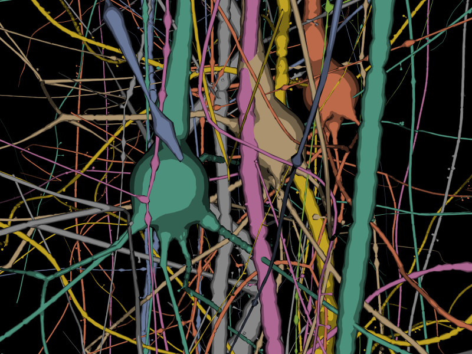

# Cartoon Module for Brayns

## Description
This module implements cartoon renderers for Brayns

## Usage
- Point LD_LIBRARY_PATH to the folder which contains
  'libospray_module_cartoon.so'
- Run Brayns application either with command line '--module cartoon --renderer cartoon' or do
  'ospLoadModule("cartoon")' programmatically
```
OSPRenderer renderer = ospNewRenderer("cartoon");
```

## Screenshots

