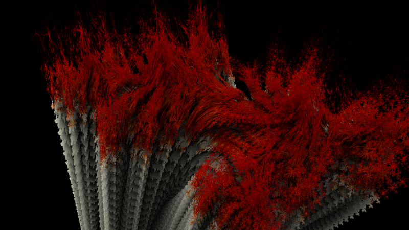

# Fractals Module for Brayns

## Description
This module implements a fractals renderer for Brayns

## Usage
- Point LD_LIBRARY_PATH to the folder which contains
  'libospray_module_fractals.so'
- Run Brayns application either with command line '--module fractals --renderer fractals' or do
  'ospLoadModule("fractals")' programmatically
```
OSPRenderer renderer = ospNewRenderer("fractals");
```

## Screenshots

