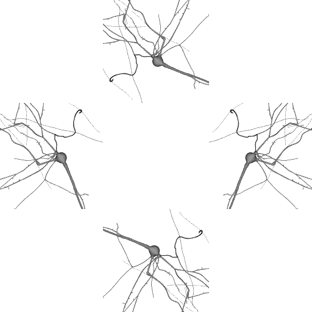

# Holography Module for Brayns

## Description
This module implements a holographic camera for Brayns

## Usage
- Point LD_LIBRARY_PATH to the folder which contains
  'libospray_module_holography.so'
- Run Brayns application either with command line '--module holography --camera holographic' or do
  'ospLoadModule("holography")' programmatically
```
OSPCamera camera = ospNewCamera("holographic");
```

## Screenshots

