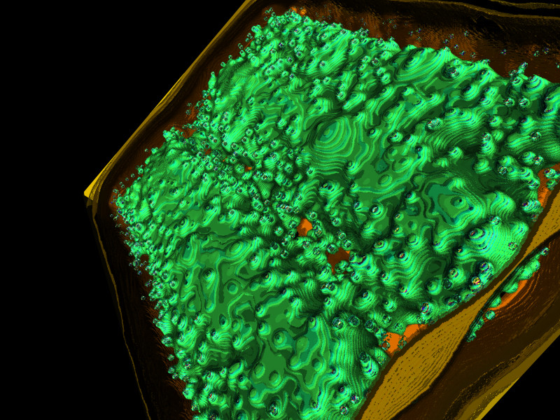

# Volume Module for Brayns

## Description
This module implements a volume renderer for Brayns

## Usage
- Point LD_LIBRARY_PATH to the folder which contains
  'libospray_module_volume.so'
- Run Brayns application either with command line '--module volume --renderer volume' or do
  'ospLoadModule("volume")' programmatically
```
OSPRenderer renderer = ospNewRenderer("volume");
```

## Screenshots

